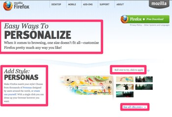

============
Localization
============

The site is fully localizable. Localization files are not shipped with the code
distribution, but are available on SVN::

    git svn clone https://svn.mozilla.org/projects/mozilla.org-l10n/trunk/ locale
    # or
    svn checkout https://svn.mozilla.org/projects/mozilla.org-l10n/trunk/ locale

Jinja2 L10n blocks
------------------

Bedrock uses a block-based translation system that divides templates (i.e., HTML
pages in English (US)) into *localizable* and *unlocalizable* parts and ensures that
only localizable content makes its way into the translatable files shown to
localizers.

This greatly reduces the complexity of localizer-facing files, reduces the room
for error and avoids unnecessary code duplication across various locales.

n
   This is an example of what parts of a page would be expressed as localizable
   blocks.

.. _Jinja2: http://jinja.pocoo.org/
.. _template inheritance: http://jinja.pocoo.org/docs/templates/#template-inheritance

A Localizers' guide to L10n blocks
~~~~~~~~~~~~~~~~~~~~~~~~~~~~~~~~~~

Let's look at how we would translate an example file from **English** to
**German**.

The English source template, created by a developer, lives under
``apps/appname/templates/appname/example.html`` and looks like this:

.. code-block:: html

    

    
      

      
      <h1>Hello world!</h1>
      

      

      
      
This is an example!

      
    

Notes:

#. ``extends`` and ``block`` are common `Jinja2`_ `template inheritance`_ idioms.
   They mean there is a "base" template called ``base.html``. This example
   template contains everything that ``base.html`` contains, however, the block
   named *content* is overwritten by the content shown here.
#. The *content* block contains an image and an ``hr`` tag, as well as two
   ``l10n`` blocks. The l10n blocks mean, these parts are localizable.
#. Every l10n block has a name that's unique to this file (here: "foo" and "bar")
#. After the l10n block's name, the developer puts a *version number* (more
   about that in the developer docs). By convention, this number is an ISO
   date, in this case the 1st of August, 2011.

The developer now runs a script to **extract** the localizable parts of this template
and put them into the localizers' **template folders**.

The newly created file lives under ``locale/de/templates/appname/example.html``.
Note that *de* is the German locale code, and *appname* and *example* match
exactly the location of the English source file shown above.

Now what does the **German localizer** see?

.. code-block:: html

    

    
    <h1>Hello world!</h1>
    

    
    
This is an example!

    

Notes:

#. This template *extends* the en-US source version of the template. Once again,
   this means all content is inherited from the "parent" file, except for the
   blocks overwritten here.
#. The file only contains the ``l10n`` blocks from the parent file -- the
   unlocalizable parts are not copied to the German file.
#. The names of the l10n blocks are the same as in the source file, but for
   simplicity's sake, there are no version numbers next to each block name.
#. The order of l10n blocks is the exact same as in the source file, as to
   preserve context.

The localizer now edits the file and replaces the content of the l10n blocks
with their own translation.

.. code-block:: html

    

    
    <h1>Hallo Welt!</h1>
    

    
    
Dies ist ein Beispiel!

    

Done! The template engine will automatically use these translated blocks and
put them into the source template in the appropriate places when rendering
the German version of this page.

Generating the locale files
~~~~~~~~~~~~~~~~~~~~~~~~~~~

./manage.py l10n_check

This command will check which blocks need to be translated and update
the locale templates with needed translations. It will copy the
English blocks into the locale files if a translation is needed.

It uses the version of a block to determine if a translation is
needed. You need to update this version (which is a date in the format
YYYYMMDD) if you want it to be re-localized.

New blocks will simply appear in english in the locale files. For
example, in the German template, it will look like:


<h1>This is an English string that needs translating.</h1>


If there was a previous translation, it will be kept in the file so
the the page will still display it:


<h1>This is an English string that needs translating.</h1>

<h1>Dies ist ein English string wurde nicht.</h1>


The localizer needs to translate the English string and remove the
else block and previous translation.
