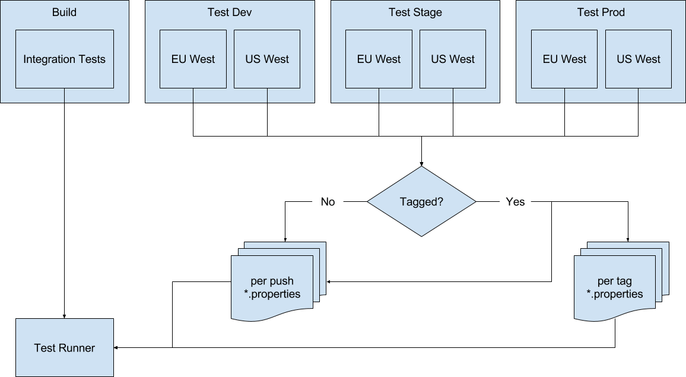

.. This Source Code Form is subject to the terms of the Mozilla Public
.. License, v. 2.0. If a copy of the MPL was not distributed with this
.. file, You can obtain one at http://mozilla.org/MPL/2.0/.

.. _pipeline:

===================================
Continuous Integration & Deployment
===================================

Bedrock runs a series of automated tests as part of continuous integration workflow and
`Deployment Pipeline`_. You can learn more about each of the individual test suites
by reading their respective pieces of documentation:

* Python unit tests (see :ref:`run-python-tests`).
* JavaScript unit tests (see :ref:`testing`).
* Redirect tests (see :ref:`testing-redirects`).
* Functional tests (see :ref:`testing`).

Tests in the lifecycle of a change
----------------------------------

Below is an overview of the tests during the lifecycle of a change to bedrock:

Local development
~~~~~~~~~~~~~~~~~

The change is developed locally, and all integration tests can be executed against a
locally running instance of the application.

Pull request
~~~~~~~~~~~~

Once a pull request is submitted, `CircleCI`_ will run both the Python and  JavaScript
unit tests, as well as the smoke suite of redirect headless HTTP(s) response checks.

Push to master (not tagged)
~~~~~~~~~~~~~~~~~~~~~~~~~~~

Whenever a change is pushed to the master branch but not tagged, the smoke suite of
headless (see :ref:`testing-redirects`) and UI tests (see :ref:`smoke-functional-tests`)
are run against Firefox on Linux. If successful, the change is pushed to the dev and
staging environments, and the full suite of headless and UI tests are then run against
Firefox on Windows 10 using `Sauce Labs`_. This is handled by the pipeline, and is subject
to change according to the `per-push properties file`_ in the repository.

.. _tagged-commit:

Push to master (tagged)
~~~~~~~~~~~~~~~~~~~~~~~

When a tagged commit is pushed to the master branch, everything that happens during a
untagged push is still run. In addition, the full suite of UI tests is run against
Chrome and Internet Explorer on Windows 10, and the sanity suite is run against older
versions of Internet Explorer (currently IE6 & IE7). If successful, the change is
pushed to production and the same tests are then run against production. As with untagged
pushes, this is all handled by the pipeline, and is subject to change according to the
`per-tag properties file`_ in the repository.

Pipeline integration
--------------------

The following diagram shows an overview of when the tests are run:

A dedicated **Test Runner** job exists to run the integration tests. This job takes various
parameters, allowing it to be called from multiple upstream jobs to cover the testing
needs. This job takes the parameters passed to it and executes `this script <https://github.com/mozilla/bedrock/blob/master/docker/jenkins/run_integration_tests.sh>`_,
which then runs `this Docker image <https://github.com/mozilla/bedrock/blob/master/docker/dockerfiles/bedrock_integration_tests>`_,
and ultimately runs `another script <https://github.com/mozilla/bedrock/blob/master/bin/run-integration-tests.sh>`_.
The two scripts can also be executed locally to replicate the way Jenkins operates.

During the **Build** stage, the Test Runner job is called without a ``BASE_URL``. This means
that a local instance of the application will be started, and the URL of this instance
will be used for testing. The ``DRIVER`` parameter is set to ``Remote``, which causes a
local instance of Selenium Grid to be started in Docker and used for the browser-based
functional UI tests.

During the various **Test** stages, the **Test Runner** job is called once for every `per-push properties file`_.
If the push was also tagged, the job is also called once for every `per-tag properties file`_.
The content of these files are used as the parameters for the Test Runner job, allowing
the configuration to be reviewed and under version control.

Configuration
~~~~~~~~~~~~~

Many of the options are configured via environment variables passed from the initial
script, to the Docker image and onto the final script. This means that global defaults
can be `configured in Jenkins`_. Note that admin access is required to make changes to the
global configuration, and there is a known issue that may cause Jenkins to `become
unresponsive`_ after a configuration change.

Updating Selenium
~~~~~~~~~~~~~~~~~

There are two components for Selenium, which are independently versioned. The first is
the Python client, and this can be updated via the `test dependencies`_. The other
component is the server, which in the pipeline is either provided by a Docker container
or `Sauce Labs`_. The ``SELENIUM_VERSION`` environment variable controls both of these, and
they should ideally use the same version, however it’s possible that availability of
versions may differ. You can check the `Selenium Docker versions`_ available. If needed, the global
default can be set and then can be overridden in the individual job configuration.

Adding test runs
~~~~~~~~~~~~~~~~

Test runs can be added by creating new `properties files`_ with the parameters of the new
test run. For example, if you wanted to run tests in Firefox on both Windows 10 and
OS X, you could create the following files

win10-firefox.properties
........................

.. code-block:: none

    DRIVER=SauceLabs
    BROWSER_NAME=firefox
    PLATFORM=Windows 10
    MARK_EXPRESSION=not headless

osx-firefox.properties
......................

.. code-block:: none

    DRIVER=SauceLabs
    BROWSER_NAME=firefox
    PLATFORM=OS X 10.11
    MARK_EXPRESSION=not headless

You can use `Sauce Labs platform configurator`_ to help with the parameter values.

Investigating failures
~~~~~~~~~~~~~~~~~~~~~~

Due to the configuration of the pipeline, it can be a little confusing when
investigating failed builds. The actual `bedrock_integration_tests_runner`_ job will fail,
and cause the upstream job that triggered it to fail. The best approach to investigating
failures is to first look at the upstream job, which will either be
`bedrock_integration_tests`_ (during the **Build** stage) or one of the ``bedrock_test_`` jobs in
the various **Test** stages:

* `bedrock_test_dev_eu_west`_
* `bedrock_test_dev_us_west`_
* `bedrock_test_stage_eu_west`_
* `bedrock_test_stage_us_west`_
* `bedrock_test_prod_eu_west`_
* `bedrock_test_prod_us_west`_

In the console log for the failed upstream job you will see a line similar to:

    ``bedrock_integration_tests_runner #n completed. Result was FAILURE``

The ``#n`` will be a valid build number, and this text will be a link directly to the
failed test runner build. Clicking this will take you to that build, where you can use
the **Console Output** or the **Test Results** links to find out what caused the build
to fail.

If you’re looking at a failed `bedrock_integration_tests_runner`_ build, you can determine
the upstream job by looking for the following text in the build status page, or in the
console output:

    ``Started by upstream project bedrock_test_ build number n``

If the job was run in `Sauce Labs`_, you can also find a link to the failed job in the
console output, which will contain a **video of the failure**.

Known issues in Jenkins
-----------------------

Shared test runner job shown in pipeline view
~~~~~~~~~~~~~~~~~~~~~~~~~~~~~~~~~~~~~~~~~~~~~

In order to avoid duplicating the test runner job for every necessary environment and
platform configuration, we use a shared job that accepts parameters. Unfortunately this
means that the pipeline view tries to show the job with the various upstream
relationships. It would be better to simply hide this job, however this functionality
does not exist. An `enhancement request`_ has been raised.

Jenkins stalls after global configuration changes
~~~~~~~~~~~~~~~~~~~~~~~~~~~~~~~~~~~~~~~~~~~~~~~~~

When using the IRC plugin for notifications, global configuration changes can cause
Jenkins to become unresponsive. To make such changes it can be necessary to first
restart Jenkins, as this issue only appears some time after Jenkins has been started.
A `bug for the IRC plugin`_ has been raised.

.. _Deployment Pipeline: https://ci.us-west.moz.works/view/Bedrock%20Pipeline/
.. _CircleCI: https://circleci.com/
.. _Sauce Labs: https://saucelabs.com/
.. _per-push properties file: https://github.com/mozilla/bedrock/tree/master/docker/jenkins/properties/integration_tests/per_push
.. _per-tag properties file: https://github.com/mozilla/bedrock/tree/master/docker/jenkins/properties/integration_tests/per_tag
.. _properties files: https://github.com/mozilla/bedrock/tree/master/docker/jenkins/properties/integration_tests
.. _bedrock_integration_tests_runner: https://ci.us-west.moz.works/view/Bedrock/job/bedrock_integration_tests_runner/
.. _bedrock_integrations_tests: https://ci.us-west.moz.works/view/Bedrock/job/bedrock_integration_tests/
.. _bedrock_test_dev_eu_west: https://ci.us-west.moz.works/view/Bedrock/job/bedrock_test_dev_eu_west/
.. _bedrock_test_dev_us_west: https://ci.us-west.moz.works/view/Bedrock/job/bedrock_test_dev_us_west/
.. _bedrock_test_stage_eu_west: https://ci.us-west.moz.works/view/Bedrock/job/bedrock_test_stage_eu_west/
.. _bedrock_test_stage_us_west: https://ci.us-west.moz.works/view/Bedrock/job/bedrock_test_stage_us_west/
.. _bedrock_test_prod_eu_west: https://ci.us-west.moz.works/view/Bedrock/job/bedrock_test_prod_eu_west/
.. _bedrock_test_prod_us_west: https://ci.us-west.moz.works/view/Bedrock/job/bedrock_test_prod_us_west/
.. _configured in Jenkins: https://ci.us-west.moz.works/configure
.. _become unresponsive: https://issues.jenkins-ci.org/browse/JENKINS-28175
.. _test dependencies: https://github.com/mozilla/bedrock/blob/master/requirements/test.txt
.. _Selenium Docker versions: https://hub.docker.com/r/selenium/hub/tags/
.. _Sauce Labs platform configurator: https://wiki.saucelabs.com/display/DOCS/Platform+Configurator/
.. _enhancement request: https://issues.jenkins-ci.org/browse/JENKINS-26210
.. _bug for the IRC plugin: https://issues.jenkins-ci.org/browse/JENKINS-28175
